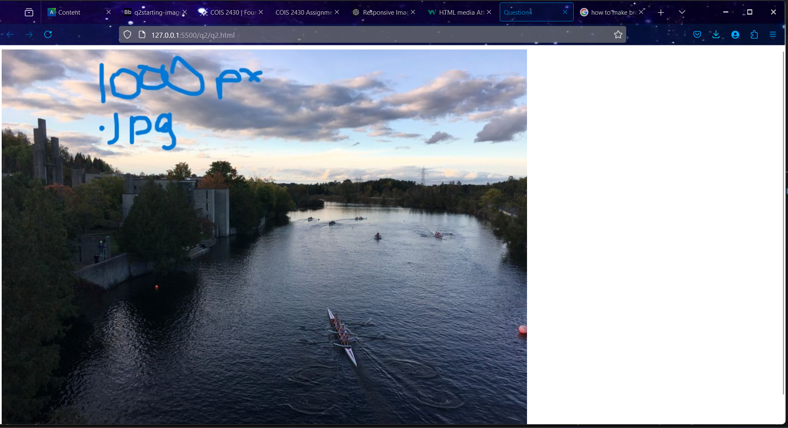

# finalSubmission

# Question 1
## Palette One
### coolers

### primary on primary

### primary for secondary

### secondary for both on primary

### secondary colour for primary ONLY

### secondary colour for both on secondary


#
#
## Palette Two

### coolers 

### primary for primary 

### primary for secondary 

### secondary for both on primary

### secondary for primary only

### secondary for both on secondary 


# Question 2
for question one I did two things to the photos to change the data around and in this question. the first was changing the type of photo used
the photos in used for the smallest size are .jpg due to how conpressed they are in comparison to the rest of the types of image files. i decided not to 
change the document type for the smallest one as the smallest photo would be shown in the smallest browser cases meaning that the compression of jpg
files won't be as noticable when compared to the size of the largest photo that was used. the jpg file is also must smaller only being 68KB compared to the 1000px png being double the 
size at  160KB and the 1250px image being 1.91 mb. On top of this photos should be loaded with as much speed as possible so when possible the 
smaller file type should be used.

however the reason that the larger files are in the png format is because of the lossess conversion format of the png.
the png keeps more data where the jpg has the chance to muddy the photo at larger sizes


```
<!DOCTYPE html>
<html lang="en">
  <head>
    <meta charset="UTF-8" />
    <meta http-equiv="X-UA-Compatible" content="IE=edge" />
    <meta name="viewport" content="width=device-width, initial-scale=1.0" />
    <title>Question4</title>
    
  </head>
  <body>
        <picture>
           
                <!-- Image for screens 600px or smaller -->
                <source media="(max-width: 600px)" srcset="question_2-(imgsForDownsizing)/600px_image.jpg">
                
                <!-- Image for screens between 601px and 1500px -->
                <source media="(min-width: 601px) and (max-width: 1500px)" srcset="question_2-(imgsForDownsizing)/1000px_image.png">
                
                <!-- Image for screens larger than 1500px -->
                <source media="(min-width: px)" srcset="question_2-(imgsForDownsizing)/1250px_image.png">
                
                <!-- Fallback image in case nothing works -->
                
              
              
        </picture>
  </body>
  </html>
```
### 600 px fullscreen

### 1000 px 2/3 screen 

### 1250 px half screen


# Question Three 
```

/* paragraph color*/
p { color: #663399}


/*heaings colour*/
h1, h2, h3 { color: #ff1493}

/*list colour*/
ul, li { color: #BE4585}

/*title color*/
.title { color: aqua}

/*first of type term*/
.term :first-of-type{ color: lime}

/*second term*/
.term:nth-of-type(2){color: cadetblue}

/*pre sky blue change*/
#var_fallback {
    color: skyblue;
}
/* nav colour changing*/
nav a:link {
    color: green;
}nav a:visited {
    color: lightgreen;
}
nav a:hover {
    color: darkgreen;
}
a :link{ color: blue;


}

/* all link colour changing */
a :visited {
    color: dodgerblue;
} 
a :hover {
    color: darkblue;
}
dl dd:nth-of-type(2) {
    color: firebrick;
  }

  /* changing all first letters in paragraphs larger and colour sienna if they are after a heading of any kind */
h1 + p::first-letter,
h2 + p::first-letter,
h3 + p::first-letter,
h4 + p::first-letter,
h5 + p::first-letter {
    color: sienna;
    font-size: 1.5em;

}
/* bullet changer for lists in the further reading section. changes every other bullet to colour goldenrod*/
#for-further-reading li:nth-of-type(odd)::marker {
    color: goldenrod
}
/* 
nav a [href^=".ca"] ::after {
    content: "😀"; 
}
nav a [href^=".docs"] ::after {
    content: "😀"; }
```
## photos of working document


this is an image of the ipad pro with all info showing along with the lighthouse statistics
### full page working on firefox 


### full page working on waterfox


### full page working on safari


### this is showing the fuctionallity of the link colour changes 


### as you can see the color changes after the link has been clicked 


### this is the link on the top page. note the other links were clicked before this 


### this is the top page after clicking link 

### this is the page working on mac


# Question 4
## css
```
 @import url('https://fonts.googleapis.com/css2?family=Lora:ital,wght@0,400;0,700;1,400;1,700&family=Share+Tech+Mono&display=swap');

 


 body{
  font-family: 'Lora', serif;
  font-size: 16px;
  font-weight: 500;
  text-size-adjust: 1.2em;
  
  
}
em{
  font-weight: 900;
}

ul {
  list-style: none;
  margin-bottom: 40px;
}
li::before {
  content: url('arrow.png'); 
  display: inline-block;
  width: 20px; /* Adjust the size of the bullet */
  height: 20px;
  margin-right: 20px; /* Adding space between the bullet and the text */
  vertical-align: middle; /* Align the bullet with the list text */
  margin-bottom: 12px;
}

h2 + p::first-letter{
font-size: 1.5em;
}
h1 {
  font-size: 2em;
  font-weight: 900;
  margin-bottom: 50px;
 
}

h2 {
  font-size: 1.5em; 
  font-weight: 900;
  
}
h3 {
  font-size: 1.5em;
  font-weight: 900;
}

h2,h3{
    color: #442b48;
    margin-bottom: 12px;
   
}
nav a:visited{
    color: #98b06f;
    font-weight: 400;
}
nav a{
    color: #726e60;
    font-weight: 400;
}
code, pre {
  font-family: 'Share Tech Mono';
  color: #98b06f;
}
i {
  font-family: 'Share Tech Mono';
  font-weight: 400;
}
p {
  margin-bottom: 16px;
  text-align: center;
}


.box {
  display: flex;
  flex-wrap: wrap;
  border: 5px solid #442b48;
  width: 100%;
  max-width: 600px;
  border-radius: 12px;
  box-sizing: border-box;
  padding-left: 12px;
  padding-right: 12px;
  padding-top: 35px;
}

.box-item {
  
  flex: 1 1 100%;
  margin: 0.25em;
}

.box-within-box {
  font-family: 'Share Tech Mono';
  background-color: black;
  margin: 7px 20px;
  padding: 10px;
  flex: 1 1 auto;
  box-sizing: border-box;
  color: #98b06f;
  width: calc(100% - 40px);
}


```
## html

```
<!DOCTYPE html>
<html lang="en">
  <head>
    <meta charset="UTF-8" />
    <meta http-equiv="X-UA-Compatible" content="IE=edge" />
    <meta name="viewport" content="width=device-width, initial-scale=1.0" />
    <link rel = "stylesheet" href = "styles/reset.css">
    <link rel = "stylesheet" href = "styles/main.css"> 
    

    <title>Question4</title>
  </head>
  <body>

    <h1> Part A - Geeky Page Content</h1>

        <div class="box">
            <div class = "box-item">
                <h2> CSS FLEXBOX: CSS <code>flex-wrap</code> <a href = "#citation1" style = "text-decoration: none;"> <sup>[1]</sup> </a></h2>
                    <p>
                    With the flexbox layout, by default flex items will all try to 
                    fit onto one line. You can change that and all the items to wrap as needed
                    with this property.
                    </p>
            </div>
        <div class = "box-item">
            <h3>Usage</h3>

    
            <h6>this property supports the following values:</h6>
                <ul>
                    <li><code>nowrap </code><em>(default)</em>: all flex items will be on one line</li>
                    <li><code>wrap:</code> flex items will wrap onto multiple line, from top to bottom </li>
                    <li><code>wrap-reverse</code>: flex items will wrap onto multiple lines from bottom to top</li>
                </ul>
        </div>
        <div class = "box-item">
            <h3> Example</h3>
        </div>

        <div class = "box-within-box">
                <pre>
                    <code>
        .container {
            flex-wrap: nowrap | wrap | wrap-reverse;
        }
                    </code>
                </pre>
        </div>
        <div class = "box-item"> 
            <h3>References</h3>
        
                <section id = "citation1">
                <ol>
                    <li>
                        
                            <em>
                                Coyier,Chris</em> <i>(Dec 9th,2013)</i> <a href="https://www.youtube.com/watch?v=dQw4w9WgXcQ"> A Complete Guide to Flexbox.</a>  
                            
                            
                        
                        <em>CSS Tricks</em>
                    </li>
                </ol>
            </section>
        </div>

        <div class = "box-item">
            <p>
                Styled by: Jamie Fletcher
            </p>
        </div>
    </div>
</body>
</html>
```
## valid html

## google chrome

## waterfox

## firefox

## safari

